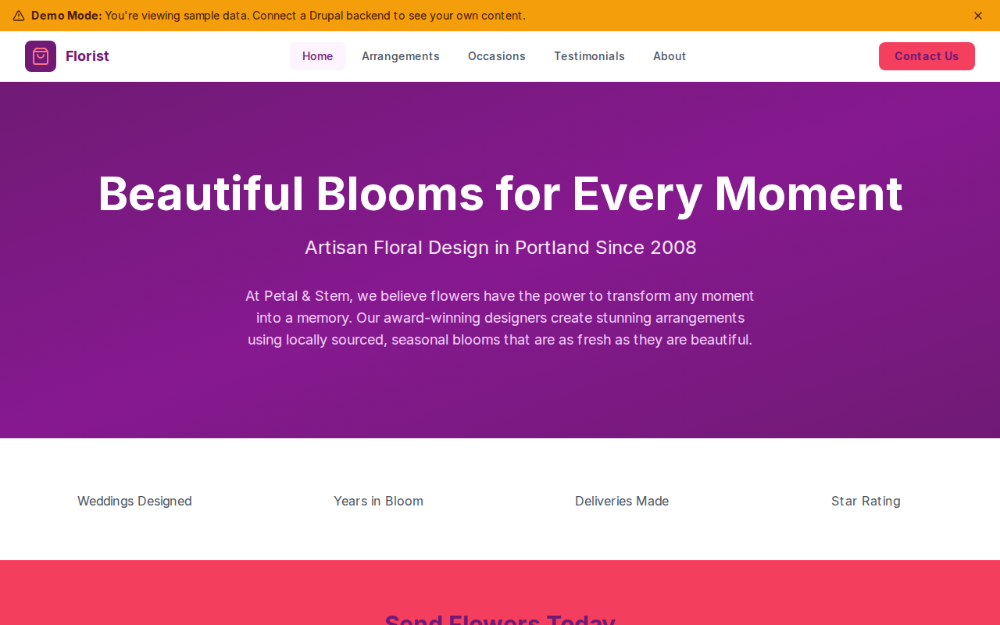

# Decoupled Florist

A modern florist website built with Next.js and Decoupled Drupal, designed for artisan flower shops to showcase arrangements, event services, and customer testimonials.



[](https://vercel.com/new/clone?repository-url=https://github.com/nicholasio/decoupled-florist&project-name=decoupled-florist)

## Features

- Browse signature floral **arrangements** with pricing, flower types, and seasonal availability
- Explore **occasion** services for weddings, corporate events, and sympathy flowers
- Read customer **testimonials** with ratings and occasion details
- Dynamic homepage with hero section, statistics, and call-to-action areas
- Static **pages** for about and contact information

## Quick Start

### 1. Clone the template

```bash
npx degit nicholasio/decoupled-florist my-florist
cd my-florist
npm install
```

### 2. Run interactive setup

```bash
npm run setup
```

### 3. Start development

```bash
npm run dev
```

Visit [http://localhost:3000](http://localhost:3000)

---

## Manual Setup

<details>
<summary>Click to expand manual setup steps</summary>

### Authenticate with Decoupled.io

```bash
npx decoupled-cli@latest auth login
```

### Create a Drupal space

```bash
npx decoupled-cli@latest spaces create "Petal & Stem Florist"
```

Note the space ID returned (e.g., `Space ID: 1234`). Wait ~90 seconds for provisioning.

### Configure environment

```bash
npx decoupled-cli@latest spaces env 1234 --write .env.local
```

### Import content

```bash
npm run setup-content
```

This imports the following sample content:

- **Arrangements:** Garden Romance ($95), Wild Meadow ($65), Modern Luxe ($120), Sunshine Burst ($55)
- **Occasions:** Wedding Flowers, Corporate Events, Sympathy & Memorial
- **Testimonials:** Elena & Marco Martinez (Wedding), Jennifer Brooks (Corporate Subscription), Daniel Kim (Birthday Delivery)
- **Pages:** About Petal & Stem, Contact Us
- **Homepage:** Hero section, statistics (850+ Weddings, 18 Years, 25,000+ Deliveries, 4.9 Star Rating), and CTA

</details>

## Content Types

### Arrangement

A floral arrangement or bouquet available for purchase.

| Field | Type | Description |
|-------|------|-------------|
| price | string | Price of the arrangement |
| flower_types | string[] | List of flower types used |
| arrangement_size | string | Size (Small, Medium, Large) |
| availability | string | Seasonal availability |
| best_for | string | Suggested occasions |
| image | image | Arrangement photo |
| body | text | Detailed description |

### Occasion

A special occasion or event type the florist serves.

| Field | Type | Description |
|-------|------|-------------|
| summary | string | Short description |
| starting_price | string | Starting price for the service |
| lead_time | string | Lead time required |
| consultation_included | bool | Whether consultation is included |
| image | image | Occasion image |
| body | text | Full service details |

### Testimonial

A customer testimonial and review.

| Field | Type | Description |
|-------|------|-------------|
| client_name | string! | Client name (required) |
| client_location | string | Client location |
| rating | integer | Star rating |
| occasion_type | string | Type of occasion |
| photo | image | Client photo |
| body | text | Testimonial text |

### Homepage

Landing page with hero section, statistics, and call-to-action areas.

| Field | Type | Description |
|-------|------|-------------|
| hero_title | string | Hero headline |
| hero_subtitle | string | Hero subheading |
| hero_description | text | Hero body text |
| stats_items | paragraph(stat_item)[] | Statistics display |
| featured_items_title | string | Featured section title |
| cta_title | string | CTA section title |
| cta_description | text | CTA body text |
| cta_primary | string | Primary button label |
| cta_secondary | string | Secondary button label |

### Basic Page

Static content pages for about, contact, policies, etc.

| Field | Type | Description |
|-------|------|-------------|
| body | text | Page content |

## Customization

### Colors & Branding

Edit `tailwind.config.js` to customize colors, fonts, and spacing for your flower shop brand.

### Content Structure

Modify `data/florist-content.json` to update arrangements, occasions, testimonials, and other sample content.

### Components

React components are in `app/components/`. Update them to match your florist's design and branding.

## Demo Mode

### Enable Demo Mode

Set the environment variable:

```bash
NEXT_PUBLIC_DEMO_MODE=true
```

Or add to `.env.local`:

```
NEXT_PUBLIC_DEMO_MODE=true
```

### What Demo Mode Does

- Shows a "Demo Mode" banner at the top of the page
- Returns mock data for all GraphQL queries
- Displays sample arrangements, testimonials, and homepage content
- No Drupal backend required

### Removing Demo Mode

To convert to a production app with real data:

1. Delete `lib/demo-mode.ts`
2. Delete `data/mock/` directory
3. Delete `app/components/DemoModeBanner.tsx`
4. Remove `DemoModeBanner` from `app/layout.tsx`
5. Remove demo mode checks from `app/api/graphql/route.ts`

## Deployment

### Vercel (Recommended)

[](https://vercel.com/new/clone?repository-url=https://github.com/nicholasio/decoupled-florist)

Set `NEXT_PUBLIC_DEMO_MODE=true` in Vercel environment variables for a demo deployment.

### Other Platforms

Works with any Node.js hosting platform that supports Next.js.

## Documentation

- [Decoupled.io Docs](https://www.decoupled.io/docs)
- [Next.js Documentation](https://nextjs.org/docs)
- [Drupal GraphQL](https://www.decoupled.io/docs/graphql)

## License

MIT
